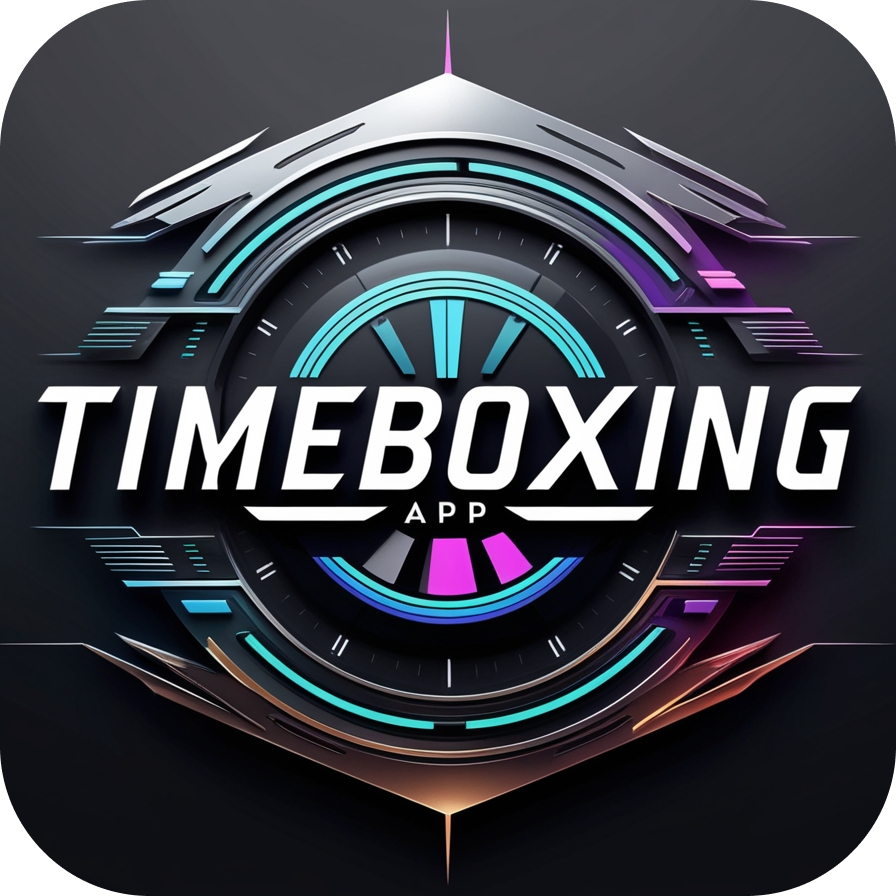

<p align="center">
  
</p>

# Timeboxing

The Timeboxing app is a web application that runs in your browser only.

## Developing

Once you've created a project and installed dependencies with `bun install`, start a development server:

```bash
bun run dev

# or start the server and open the app in a new browser tab
bun run dev -- --open
