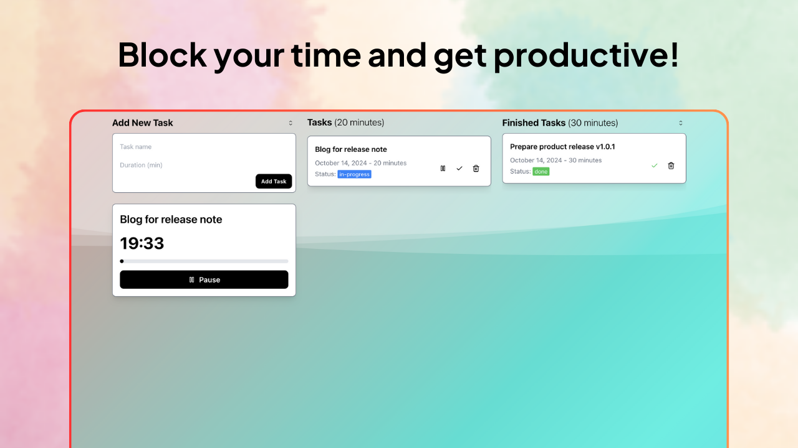

# Timeboxing

<p align="center">
  
</p>

A super simple timeboxing app that runs exclusively in your browser.

## Developing

Once you've created a project and installed dependencies with `bun install`, start a development server:

```bash
bun run dev

# or start the server and open the app in a new browser tab
bun run dev -- --open
